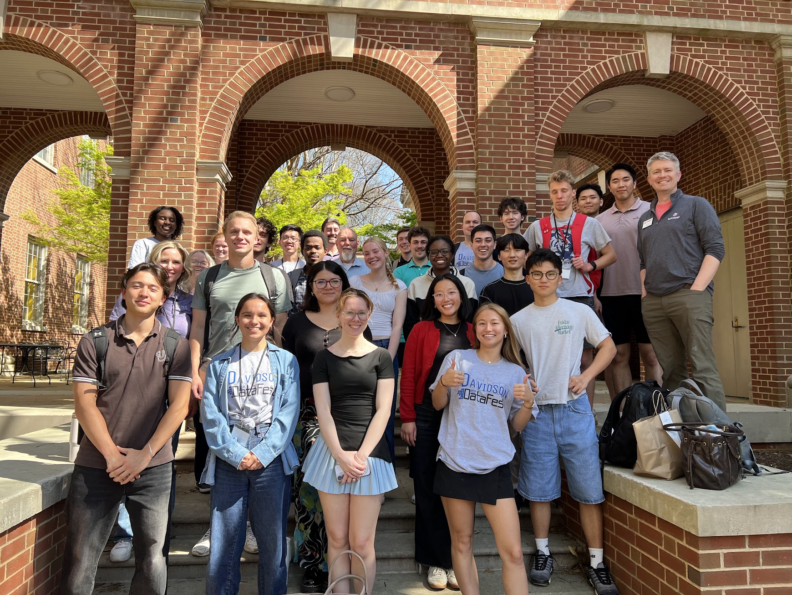
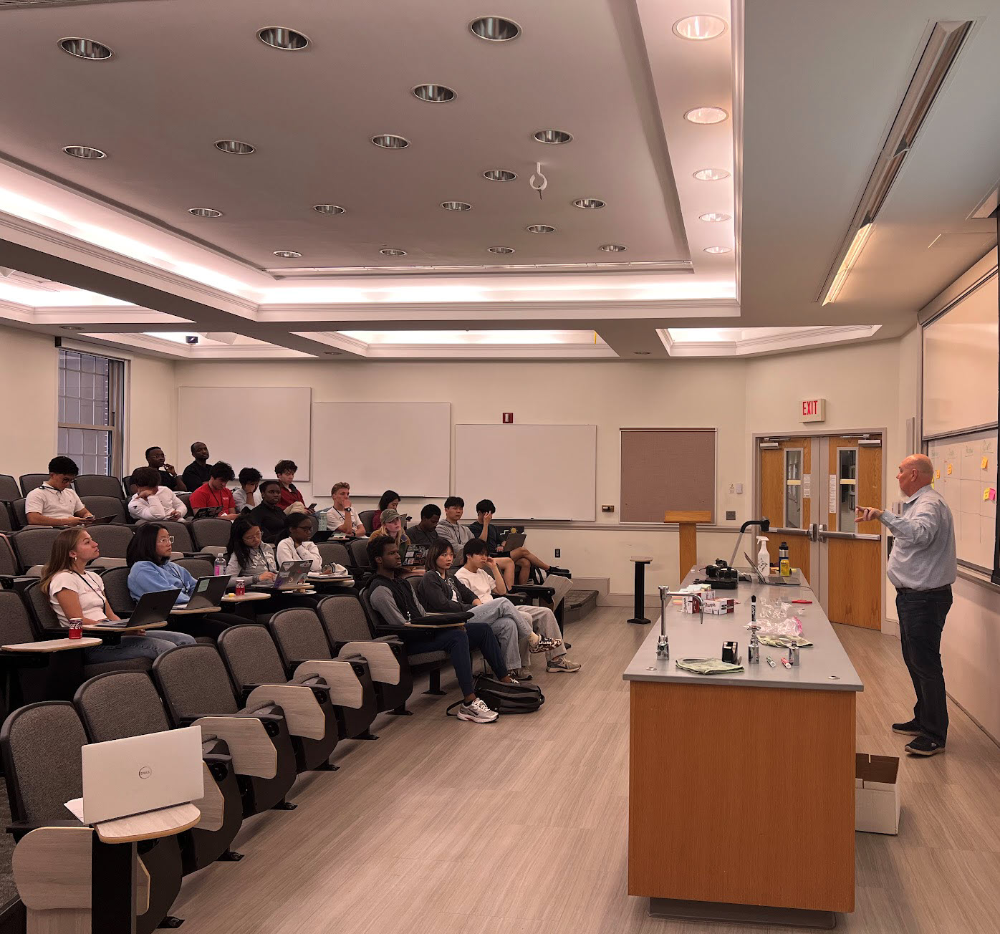
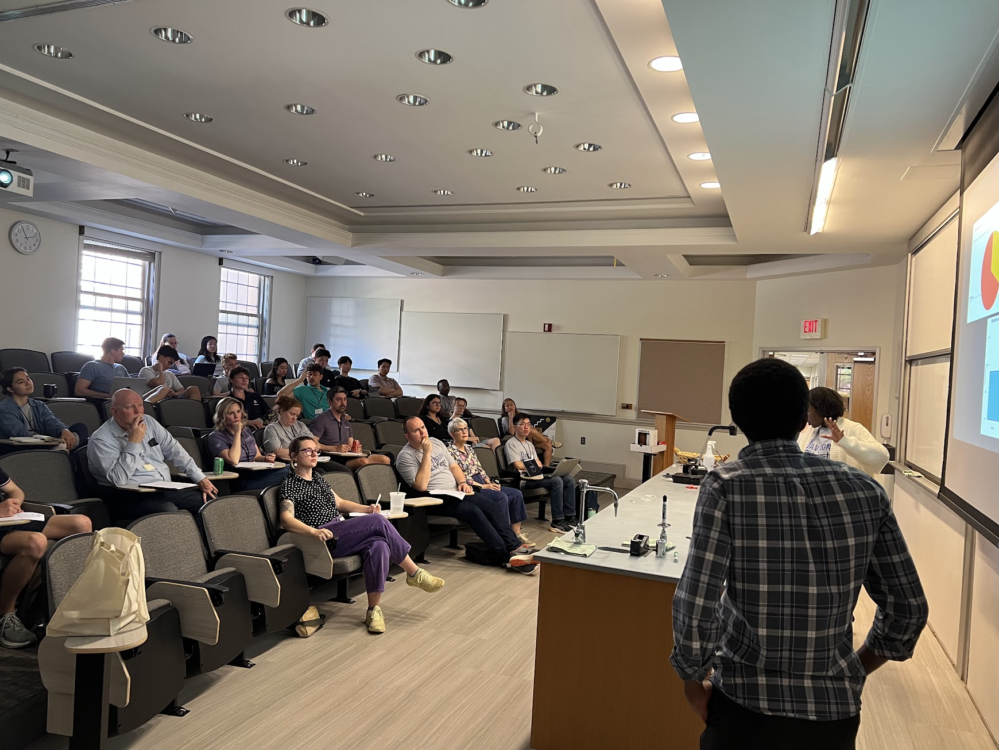
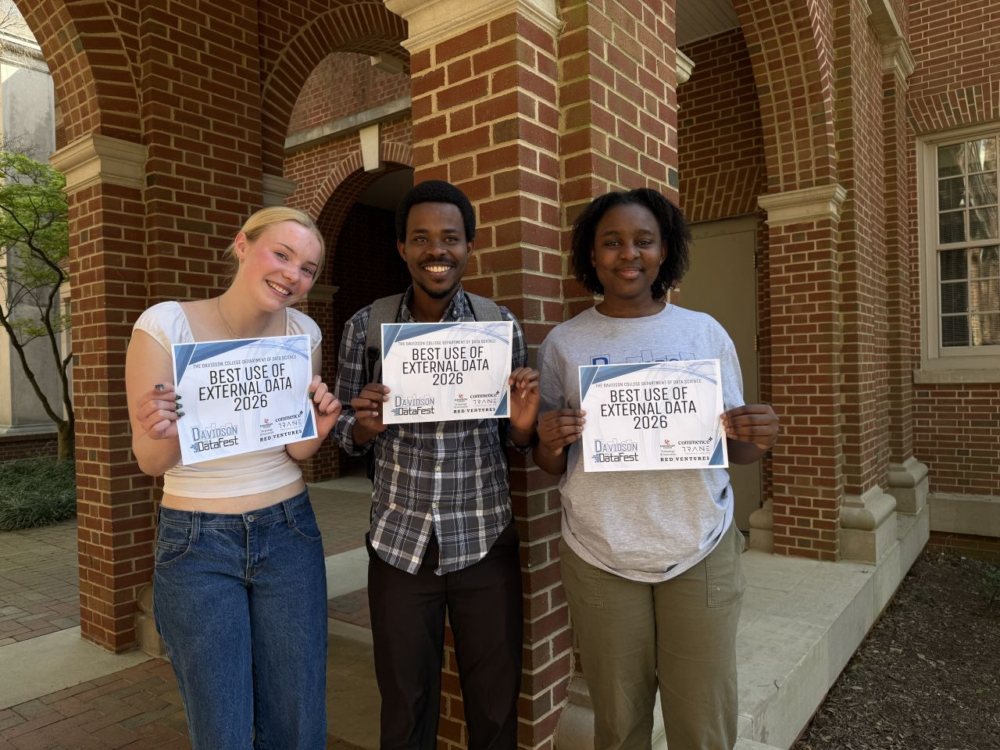

DataFest at Davidson College is not just a competition, but also an opportunity to learn how to code, collaborate and use data to solve real-world problems. From cleaning messy datasets to collaborating with industry leaders like Trane Technologies, Bioinformatics major Eliezer Majambere ’27 reflects on his experience. 

*The following article was written by Eleiezer Majambere '27 and originally published by [Davidson College News](https://www.davidson.edu/news/2026/05/21/uncertainty-insight-how-datafest-transformed-way-i-understand-data){target="_blank"} on May 21, 2026.*

```{r}
#| echo: false
#| output: asis
library(rvest)

url <- "https://www.davidson.edu/news/2026/05/21/uncertainty-insight-how-datafest-transformed-way-i-understand-data"
page <- read_html(url)

all_paras <- page |>
  html_elements(".body-section p") |>
  html_text2()

# Intro paragraph
intro_idx <- grep("^DataFest at Davidson College is not just", all_paras)
cat(all_paras[intro_idx], "\n\n")

cat("---\n\n")

# Main article body
body_start <- grep("^DataFest has become one of the most meaningful", all_paras)
body_end   <- grep("to better understand the world and contribute to meaningful solutions", all_paras)
cat(paste(all_paras[body_start:body_end], collapse = "\n\n"), "\n\n")

cat("---\n\n")

# About the Author
cat("### About the Author\n\n")
about_paras <- page |>
  html_elements(xpath = "//h4[contains(text(), 'About the Author')]/following-sibling::p") |>
  html_text2()
cat(paste(about_paras, collapse = "\n\n"), "\n\n")
```

## Gallery

{group="datafest2026" fig-alt="DataFest students and mentors in a group photo"}

{group="datafest2026" fig-alt="A group of people in a classroom observing a speaker"}

{group="datafest2026" fig-alt="A group of people in a classroom observing two speakers"}

{group="datafest2026" fig-alt="Three team members standing together, holding up their certificates for winning an award"}
