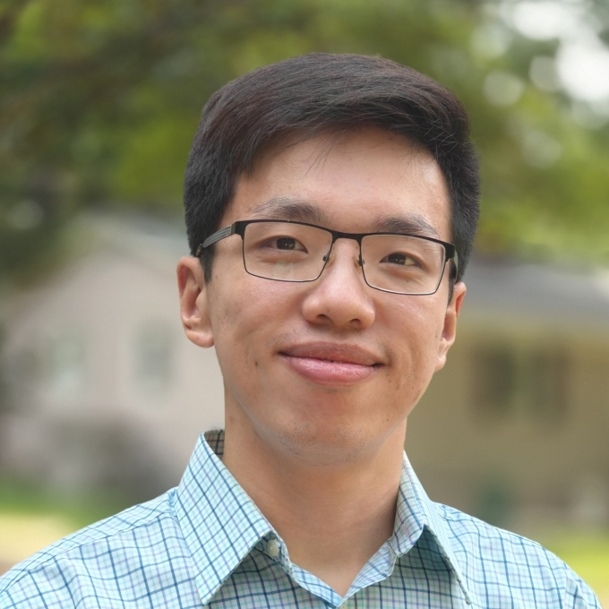

{fig-align="center" width="50%"}

It was 8AM, and students were gathered at the Simons Hall for a lecture on Applied Statistics. As the big glass windows ushered in the first rays of Dallas sunrise and some 80s music played in the background, students buried their faces behind their laptop screen for their daily quiz. Among them, there it was, me: a first-year student who somehow decided to take a statistics class at 8AM. It was there I first fell in love with statistics, which would end up being my career; it was there I befriended Bivin Sadler who guided me through 8 years of statistical journey; and it was there I first learned about the inaugural DataFest at Southern Methodist University (SMU).

As a student who just learned regression and R in class, I did not have much of a clue what it would take to tackle a complex dataset. Nonetheless, I, just like so many others in the class, said yes to my professor and decided to dip our toes into the real world. Being the inaugural DataFest at SMU and the first and only in Texas, the 2018 iteration operated on a smaller scale, but it was just as fun as every DataFest I’ve been to. I vividly remember meeting my teammates for the first time on Friday night, trying to open gigabytes of csv files with R, and working our way through the night. At SMU, we closed the door at midnight, but there I was, standing by the whiteboard at 12:10AM asking Bivin more statistical questions until we realized how late it was. Who needed sleep when we could do statistics? Well, the today-year-old me does now.

The next two days followed with lots of debugging, trying different models, and very little sleep. In between all the statistical marathon, I had to take a lengthy in-class review Saturday morning (well, we call them tests at SMU, but I won’t tell them I’ve abandoned their terminology, and this is story for another time). Although we went into the presentation on Sunday with high hopes, we did not win. However, one valuable lesson I learned is that when dealing with a complex dataset, simple insights are key. The winning team had a very specific focus with great recommendations, and they went home with the trophy. Among all the years I was involved, this theme rang true again and again: there was always to too much to do with very little time and place for grandiosity. Did I learn my lesson and win the second year? No, I lost again.

Given how much I loved statistics and data science, I went straight to grad school to get a PhD in statistics. All of a sudden, I found myself at the other end of the DataFest being a mentor. While I was unable to share any triumphant stories, I tremendously enjoyed sharing new methods and tips with students. The moment I would never forget is when I showed a group of students who had never programmed before how to do mapping in R. The joy they had when they got the map working fully embodied what DataFest is meant to be: a place where everyone, regardless of background, comes together to share the same passion for insight and learning. As mentor, I never missed a single DataFest, and each one meant something special to me and all the people I came to know. It was truly inspiring to see SMU’s DataFest grow from a small-scale event in 2017 to a multi-school celebration with more than 100 students from across the state.

At Davidson, I again find myself crossing path with DataFest, and this time, I am one of the organizers and in the position to encourage my own students to attend. Seeing everyone’s enthusiasm towards DataFest this year and how I myself can effect changes to positively shape students’ data science journey, I realized that I’m giving back to what defined me and my career.  DataFest started when I took my first baby step in my statistical journey, and it saw me through every major milestone, from graduate school admission to dissertation defense. As I reflect on my experiences, one thing is clear: I would not be who I am if I decided not to take that 8AM class which introduced me to DataFest. DataFest knows me better than I know myself, and the tradition will continue. 

Stay tuned.

### About the Author

Dr. Kevin Wang is an Assistant Professor of Data Science at Davidson College. You can read his official college biography [here](https://www.davidson.edu/people/kevin-wang){target="_blank"}.
