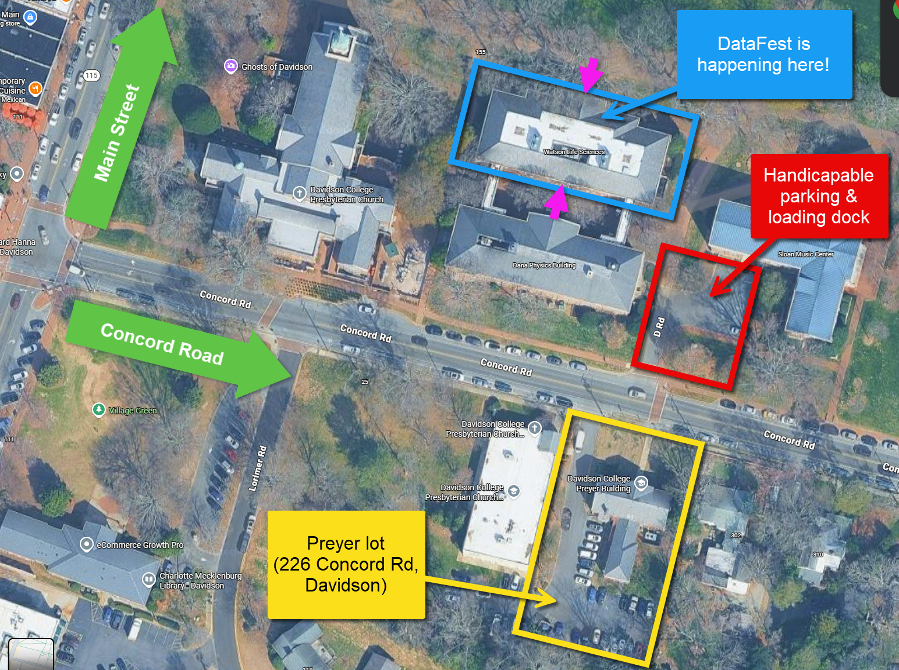
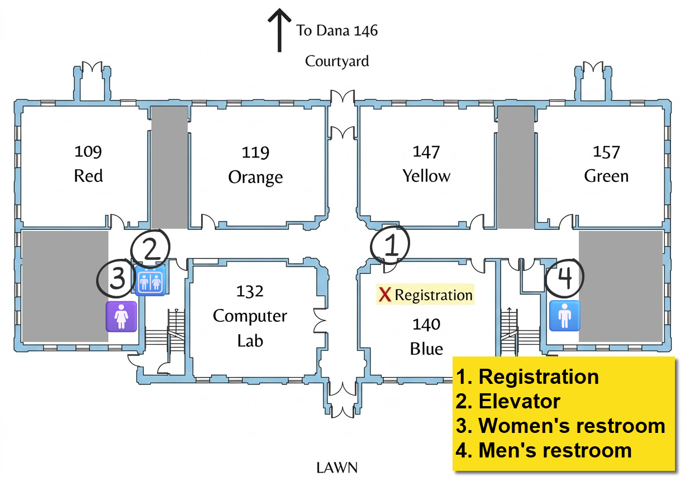

:::{#hero-heading}
```{=html}
<div id="flipdown" class="flipdown"></div>

<script>
  const targetTimestamp = new Date('2026-03-20T15:00:00-05:00').getTime() / 1000;
  new FlipDown(targetTimestamp).start();
</script>
```
:::

## What is DataFest? {#about}

Brought to you by the American Statistical Association (ASA) and the Davidson College Department of Data Science, DataFest is a data analysis competition in which teams of students have 48 hours to analyze a large, complex dataset and find the stories hidden within. Hosted at colleges and universities across the country every spring, Davidson's own DataFest brings together students with mentors from the faculty and local companies, offering not only guidance and fellowship, but also networking and recruitment opportunities!

At the end of the event, each team gets a few minutes to present their findings to a panel of judges, and prizes are given for the best work!

---

## Location {#location}

DataFest 2026 will be taking place in the Watson Life Sciences building on Davidson's campus. Parking is available in the Preyer lot, which is directly across Concord Road.

<iframe src="https://www.google.com/maps/embed?pb=!1m18!1m12!1m3!1d1433.7712338430547!2d-80.84767879290608!3d35.49958731445351!2m3!1f0!2f0!3f0!3m2!1i1024!2i768!4f13.1!3m3!1m2!1s0x8856aa3657441de1%3A0x75a76ac021be6677!2sWatson%20Life%20Sciences%2C%20225%20Concord%20Rd%2C%20Davidson%2C%20NC%2028036!5e1!3m2!1sen!2sus!4v1770923375616!5m2!1sen!2sus" width="100%" height="450" style="border:0;" allowfullscreen="" loading="lazy" referrerpolicy="no-referrer-when-downgrade"></iframe>

{.lightbox}

{.lightbox}

---

## Schedule {#schedule}

::: {.callout-note appearance="minimal"}

## Friday, March 20

|  |  |  |
|-----------|----------------------|----------|
| 3:30 - 4:00 PM | Sign in at the welcome desk, get your nametag and t-shirt, and proceed to Dana 146 for the kickoff. | Watson 140 (Blue) |
| 4:00 - 5:00 PM | Attend the **kickoff** event! Learn about our sponsors and this year's competition, and receive access to the dataset. | Dana 146 |
| 5:00 - 5:30 PM | **Workshop**: "Organizing Your DataFest Project with the Agile Scrum Framework" by Prof. Pete Benbow (Data Science) | Dana 146 |
| 5:30 - 6:30 PM | Find a spot for your team in one of our group workspaces spread throughout Watson, and begin your initial data review and brainstorming! | Group workspaces |
| 6:30 - 7:00 PM | Pick up your Osito's Tacos dinner, take it back to your workspace, and get to work! | Watson 140 (Blue) |
| 7:00 - 10:00 PM | Work session | Group workspaces |
| 8:00 - 8:30 PM | **Workshop**: "Machine Learning with Python" by Dr. Kevin Wang (Data Science) | Dana 146 |

:::

::: {.callout-note appearance="minimal"}

## Saturday, March 21

|  |  |  |
|-----------|----------------------|----------|
| 9:00 - 10:00 AM | Pick up breakfast and coffee | Watson 140 (Blue) |
| 10:00 - 10:30 AM | **Workshop**: "Maps in R" by Dr. Laurie Heyer (Data Science) | Dana 146 |
| 10:30 AM - 12:30 PM | Work session | Group workspaces |
| 12:30 - 1:00 PM | Pick up your Mandolino's lunch! | Watson 140 (Blue) |
| 1:00 - 6:30 PM | Work session | Group workspaces |
| 6:30 - 7:00 PM | Pick up your Masala Mastee dinner! | Watson 140 (Blue) |
| 7:00 - 10:00 PM | Work session | Group workspaces |

:::

::: {.callout-note appearance="minimal"}

## Sunday, March 22

|  |  |  |
|-----------|----------------------|----------|
| 10:00 - 10:30 AM | Enjoy brunch, brought to you by Milkbread! | Watson 140 (Blue) |
| 10:30 AM - 12:30 PM | Work session | Group workspaces |
| 12:30 - 1:30 PM | Upload slides & practice presentations | Group workspaces |
| 1:30 - 2:45 PM | Present your work! Each team will have 3 minutes to share their insights and what they accomplished. | Dana 146 |
| 2:45 - 3:30 PM | Enjoy a snack and network with our sponsors while the judges deliberate. | Dana-Watson Courtyard |
| 3:30 - 4:00 PM | Attend the final ceremony where awards will be announced and a boatload of gratitude will be shared! | Dana 146 |

:::

---

## Frequently Asked Questions (FAQ) {#faq}



---

## Sponsors {#sponsors}

::: {#sponsors-listing}
:::

Interested in sponsoring Davidson DataFest? Contact [Pete Benbow](mailto:pebenbow@davidson.edu) to get involved!

---

## Blog {#blog}

::: {#blog-listing}
:::

